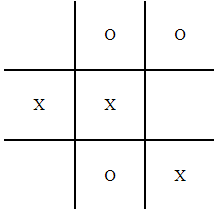

# Tres en Raya

Este proyecto es un juego de **Tres en Raya** desarrollado en **JavaScript**, **HTML**, y **CSS**. Es un ejercicio básico para practicar manipulación del DOM, eventos y lógica en un entorno web.

  

## Descripción

- Dos jugadores toman turnos para colocar su símbolo (X o O) en un tablero de 3x3.
- El objetivo es alinear tres símbolos consecutivos de forma horizontal, vertical o diagonal.
- Si se llena el tablero sin un ganador, el juego termina en empate.
- Incluye un botón para reiniciar la partida.

## Archivos

- `index.html`: Contiene la estructura principal del juego.
- `Tres.js`: Implementa la lógica del juego, detección de ganadores y reinicio del tablero.
- `Tres.css`: Proporciona el diseño visual del tablero y los estilos generales.

## Cómo usar

1. Descarga los archivos del proyecto.
2. Abre el archivo `index.html` en tu navegador.
3. Juega con un amigo alternando turnos.

## Tecnologías utilizadas

- **HTML5**
- **CSS3**
- **JavaScript **

## Notas

Este proyecto fue desarrollado durante el primer año de **DAW** y no se han realizado mejoras avanzadas. Es un ejercicio básico para fines educativos.
